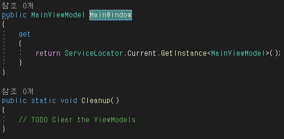

# mvvmlight-Net Framework 4.7.2

> mvvmlight를 사용하여 mvvm패턴 활성화 및 기본 세팅

## NuGet으로 mvvmlight 설치

- `참조` 우클릭 후 `NuGet 패키지 관리` 클릭

- `찾아보기`로 탭 이동 후 `mvvmlight` 안정적인 버전으로 설치 및 라이센스 동의

- `ViewModelLocator`로 오면 `ServiceLocator`를 불러오지 못 하고 있음.

- `using Microsoft.Practices.ServiceLocation;` 부분을 `using CommonServiceLocator;`로 변경

- `public MainViewModel Main`을 `public MainViewModel MainWindow`로 변경(필수 아님)

- 한번 빌드 후 `MainWindow.xaml`에서 `DataContext="{Binding Source={StaticResource Locator}, Path=MainViewModel}"` 세팅
  - Path 부분은 `ViewModelLocator` 이름 기준

## View 폴더 생성 후 연동

> 필수는 아니지만, View들이 많아질수록 솔루션 탐색기가 더러워지기 때문에 추천하는 방법

- View 폴더 생성 후 `MainWindow`를 하위로 넣어줌

- `MainWindow.xaml.cs`에서 `namespace` 뒤에 `.View` 추가

- `MainWindow.xaml`에서 `X:Class.{{ ProjectName }}.View.MainWindow`로 수정

- `App.xaml`에서 `StartupUri="MainWindow.xaml"`를 `StartupUri="View/MainWindow.xaml"`로 변경

