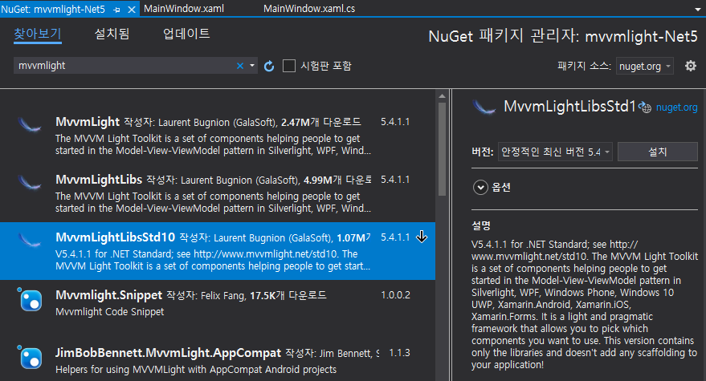
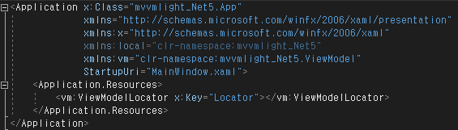
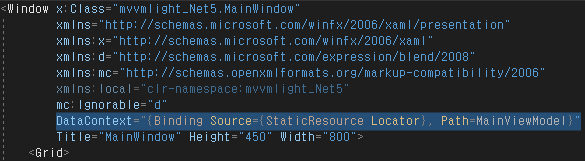
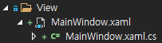
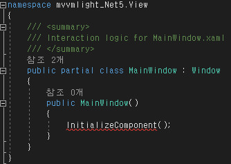
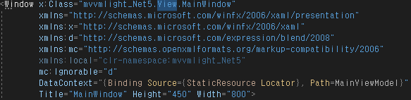
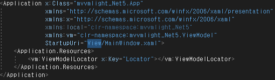

# mvvmlight-Net5

> mvvmlight를 사용하여 mvvm패턴 활성화 및 기본 세팅


## NuGet으로 MvvmLightLibsStd10 설치

- `참조` 우클릭 후 `NuGet 패키지 관리` 클릭, `MvvmLightLibsStd10` 설치




- `ViewModel` 폴더 생성, `MainViewModel.cs`와 `ViewModelLocator.cs` 생성

  

  MainViewModel.cs

  ```csharp
  using GalaSoft.MvvmLight;
  
  namespace {{ ProjectName }}.ViewModel
  {
      public class {{ ProjectName }} : ViewModelBase
      {
          public MainViewModel()
          {
              
          }
      }
  }
  ```

  

  ViewModelLocator.cs

  ```csharp
  using GalaSoft.MvvmLight.Ioc;
  
  namespace {{ ProjectName }}.ViewModel
  {
      public class ViewModelLocator
      {
          public ViewModelLocator()
          {
              SimpleIoc.Default.Register<MainViewModel>();
          }
  
          public MainViewModel MainViewModel
          {
              get => SimpleIoc.Default.GetInstance<MainViewModel>();
          }
      }
  }
  ```

  

- `App.xaml` 수정
  - `xmlns:vm="clr-namespace:{{ ProjectName }}.ViewModel"` 추가
  - `<vm:ViewModelLocator x:Key="Locator"></vm:ViewModelLocator>` 추가 후 빌드




- `MainWindow.xaml`에서 `DataContext="{Binding Source={StaticResource Locator}, Path=MainViewModel}"` 세팅




## View 폴더 생성 후 연동

> 필수는 아니지만, View들이 많아질수록 솔루션 탐색기가 더러워지기 때문에 추천하는 방법


- View 폴더 생성 후 `MainWindow`를 하위로 넣어줌




- `MainWindow.xaml.cs`에서 `namespace` 뒤에 `.View` 추가




- `MainWindow.xaml`에서 `X:Class.{{ ProjectName }}.View.MainWindow`로 수정




- `App.xaml`에서 `StartupUri="MainWindow.xaml"`를 `StartupUri="View/MainWindow.xaml"`로 변경, 빌드




- 프로젝트가 제대로 보이지 않을 시, Visual Studio 재실행

